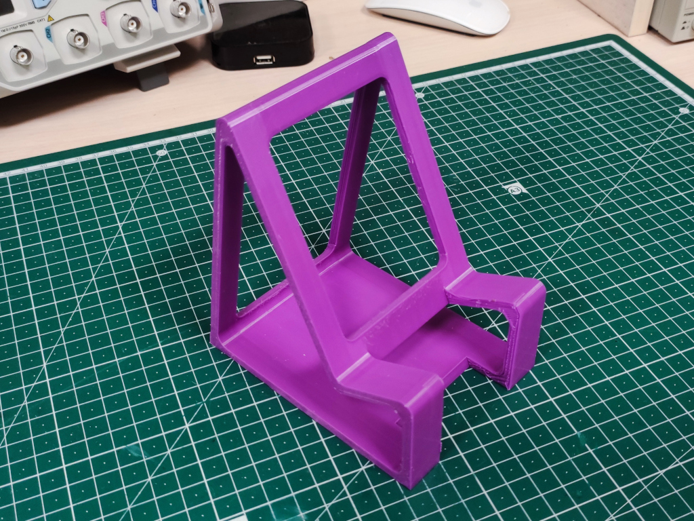
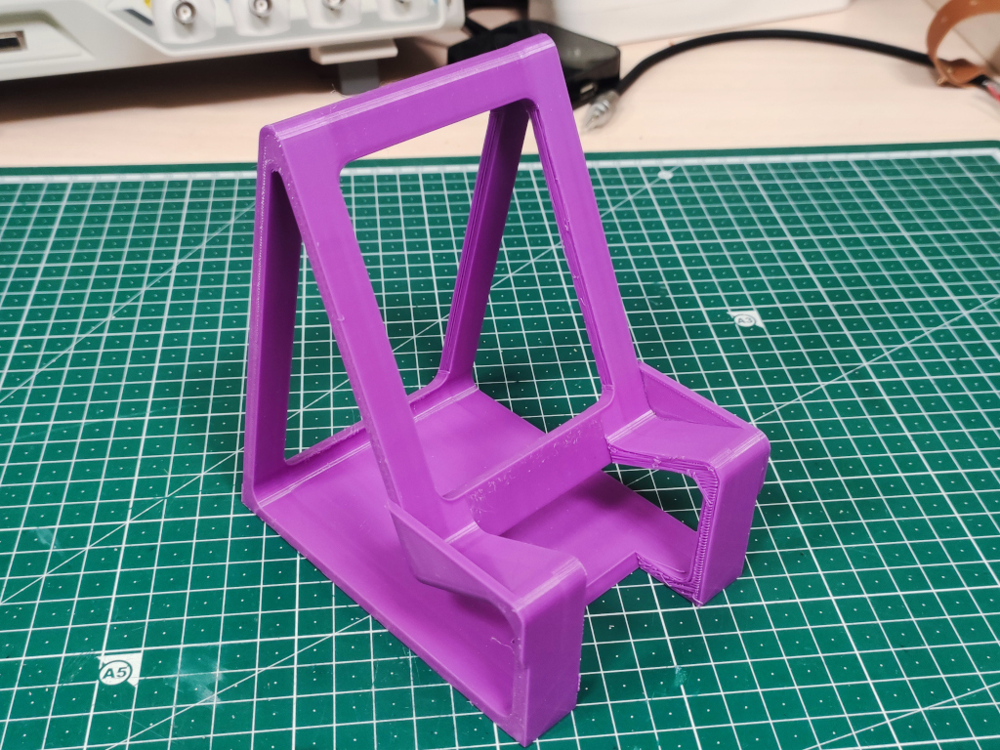
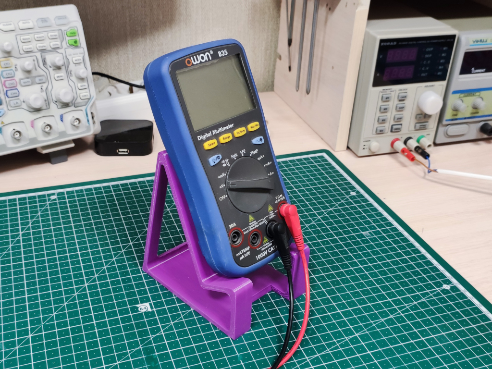
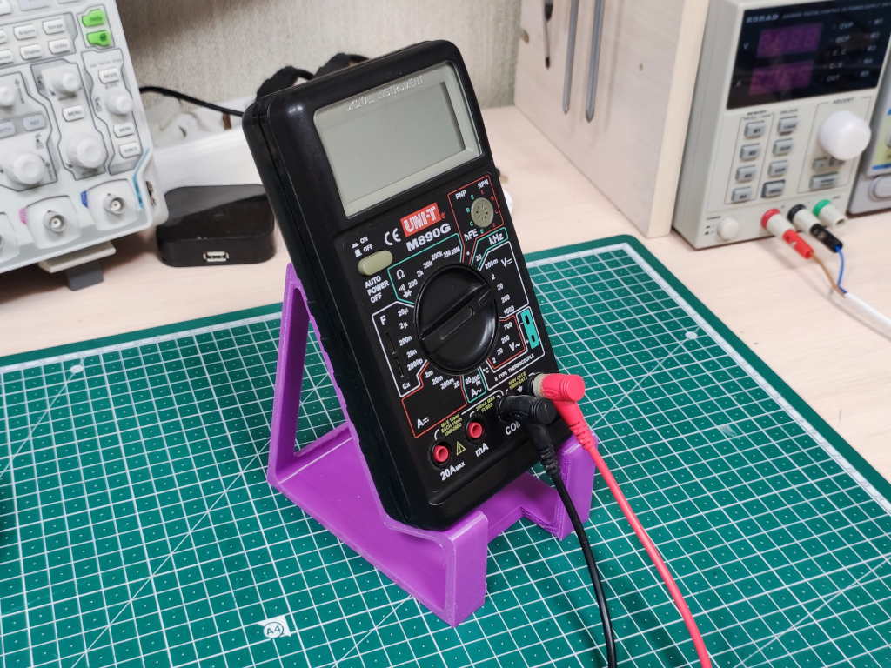
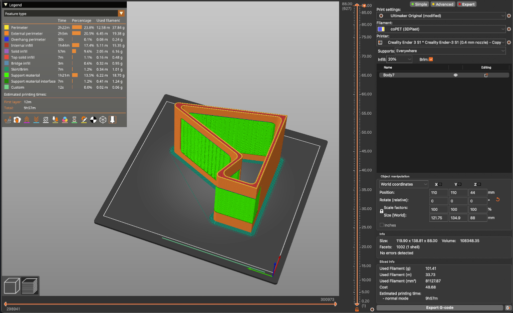
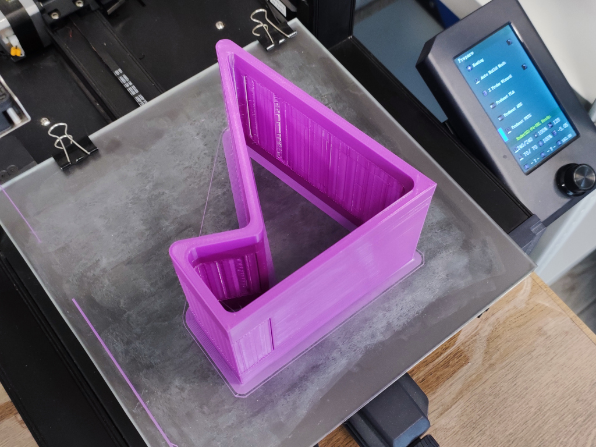

# Multimeter stand

## How to build

- Open the [STL-file](stl/MultimeterStand.3mf) in your favorite slicer.
- Prepare, slice and print.

## How to customize

- Open [source 3D model](src/MultimeterStand.f3d) in [Autodesk Fusion 360].
- Open "Parameters" dialog and set variables in "User Parameters" for your needs.
- Export STL.

## Contributing

Please read [CONTRIBUTING.md](CONTRIBUTING.md) for details.

## Versioning

I use [SemVer](http://semver.org/) for versioning. For the versions available, see the
[tags on this repository](https://github.com/ashep/multimeter-stand/tags).

## See also

- [Project on Thingiverse](https://www.thingiverse.com/thing:3948771).
- [Project on Hackster](https://www.hackster.io/ashep/multimeter-holder-f07ec9).

## Authors

- [Oleksandr Shepetko](https://shepetko.com) -- initial work.

## License

This project is licensed under the MIT License. See the [LICENSE](LICENSE) file for details.

## Changelog

### 0.1 (2024-01-13)

Initial release.

[Autodesk Fusion 360]: https://www.autodesk.com/products/fusion-360/overview
