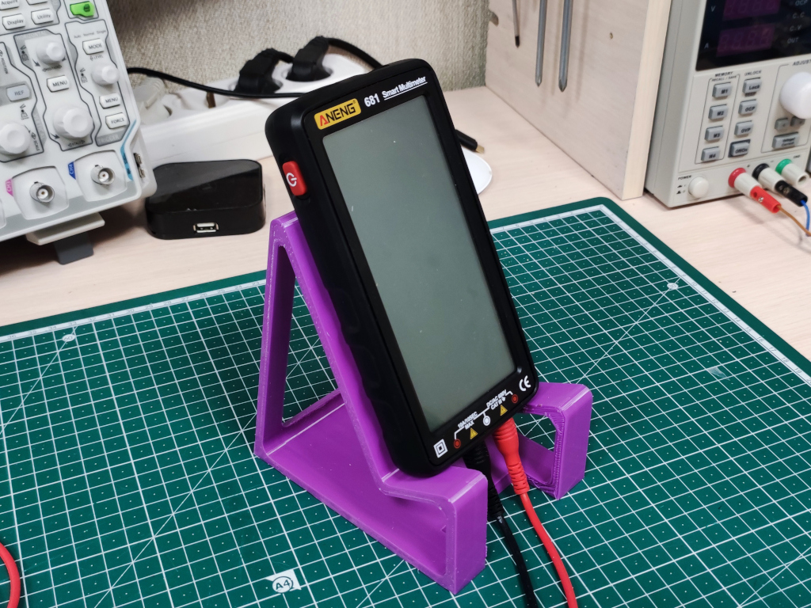

# Multimeter stand

A sleek and customizable solution to keep your workspace organized. This stand boasts a sturdy design and customizable dimensions for a perfect fit for your multimeter, all without the need for assembly. With a modern aesthetic, it's the ideal accessory for electronics enthusiasts and professionals seeking a clutter-free workspace. Elevate your efficiency today!

## How to build

- Open files from the [stl](stl) directory in your favorite slicer.
- Prepare, slice and print.
- `LeftLimiter` and `RightLimiter` should be glued to the stand if you need them.

## How to customize

- Open [source 3D model](src/MultimeterStand.f3d) in [Autodesk Fusion 360].
- Open "Parameters" dialog and adjust necessary variables in "User Parameters" for your needs.
- Export.

## Contributing

Please read [CONTRIBUTING.md](CONTRIBUTING.md) for details.

## Versioning

I use [SemVer](http://semver.org/) for versioning. For the versions available, see the
[tags on this repository](https://github.com/ashep/multimeter-stand/tags).

## See also

- [Project on Thingiverse](https://www.thingiverse.com/thing:6431788).

## Authors

- [Oleksandr Shepetko](https://shepetko.com) -- initial work.

## License

This project is licensed under the MIT License. See the [LICENSE](LICENSE) file for details.

## Changelog

### 0.2 (2024-01-19)

Add side limiters.

### 0.1 (2024-01-13)

Initial release.

[Autodesk Fusion 360]: https://www.autodesk.com/products/fusion-360/overview
